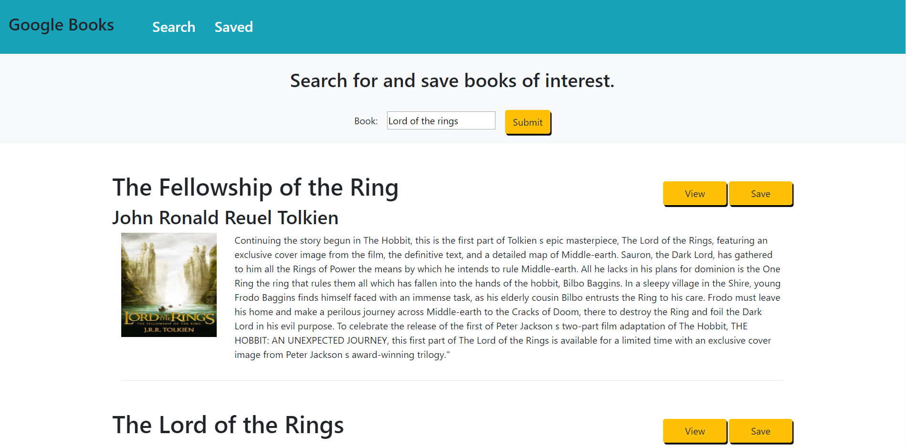

# GoogleBooksSearch

In this repository I created a MERN application that allows the user to search for and save books. There are two pages in this application: "Search" and "Saved". On the Search page, the user is able to search for books and then view information about them. The user has the ability to save a book, storing it in the database. If the user has the application open in multiple browsers, the notification for the saved book will appear in all of the browsers.

This application uses the Google Books API as well as Socket.IO.

[Here is a link to the application.](https://intense-anchorage-26607.herokuapp.com/search)

